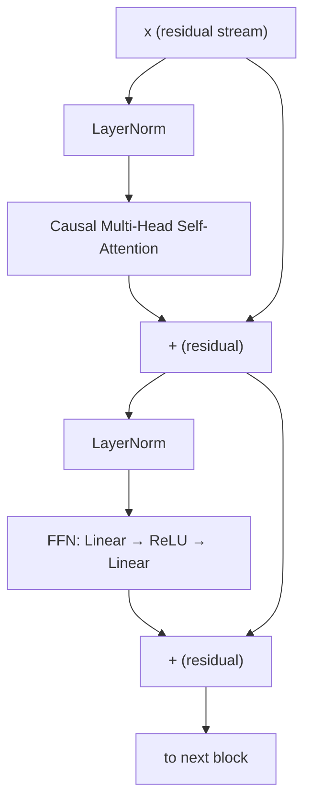

# Synapse V1

A decoder-only Transformer language model **implemented from scratch in PyTorch** and trained
on the Tiny Shakespeare corpus at the character level.

> **Scope & honesty:** Synapse V1 is a small **educational / research** language model
> (~0.83M parameters) trained on a single ~1 MB text file. It is meant to demonstrate a
> correct, readable, from-scratch Transformer implementation and training pipeline — **not**
> to compete with, or be compared to, modern large language models. It only knows the
> characters and patterns of Tiny Shakespeare.

The attention mechanism, causal masking, positional embeddings, Transformer blocks, and
language-model head are all written by hand — the project deliberately avoids
`torch.nn.Transformer` and `torch.nn.MultiheadAttention`.

- **Weights (SafeTensors) on Hugging Face:** _link added once the HF repo is published_
- **Best validation loss:** `1.6539` (cross-entropy, character-level)

---

## What's in this repo

| File | Purpose |
| --- | --- |
| `model.py` | The from-scratch Transformer (attention, blocks, embeddings, LM head). |
| `train.py` | Reusable tokenizer, dataset, dataloader, optimizer, loss, train/eval loop. |
| `train_model.py` | Training entry point (config + data split + checkpointing). |
| `generate.py` | Autoregressive text generation from a trained checkpoint. |
| `scripts/export_hf.py` | Exports the checkpoint to a SafeTensors + config + tokenizer bundle. |
| `checkpoints/best_model.pt` | Trained checkpoint (weights + config + tokenizer + history). |
| `data/input.txt` | Tiny Shakespeare training corpus (~1.1 MB). |

---

## Architecture

Synapse V1 is a standard **decoder-only (GPT-style)** Transformer with **learned** token and
positional embeddings and a **Pre-LN** (pre-layernorm) residual structure.

```
                    input token ids  (batch, seq)
                             │
              ┌──────────────┴──────────────┐
      token embedding                positional embedding
        (vocab→d_model)      +        (position→d_model)
              └──────────────┬──────────────┘
                             │
             ┌───────────────▼───────────────┐   ×  num_layers
             │        Transformer Block       │
             │                                │
             │   x = x + MHA( LayerNorm(x) )   │   ← Pre-LN + residual
             │   x = x + FFN( LayerNorm(x) )   │   ← Pre-LN + residual
             └───────────────┬───────────────┘
                             │
                     final LayerNorm
                             │
                    LM head  (d_model→vocab)
                             │
                       logits  (batch, seq, vocab)
```

**Block internals (per layer):**



### Attention implementation
`MultiHeadAttention` (in `model.py`) projects the input to Q, K, V with separate `nn.Linear`
layers, reshapes into `num_heads` heads of size `d_head = d_model / num_heads`, and computes
scaled dot-product attention manually:

`scores = (Q · Kᵀ) / √d_head` → causal mask → `softmax` → `· V` → concat heads → output projection.

### Causal masking
A lower-triangular boolean mask (`torch.tril`) is built for each sequence and applied with
`masked_fill(~mask, -inf)` **before** the softmax, so each position can only attend to itself
and earlier positions (no information leaks from the future).

### Positional embeddings
Positions `0 … seq-1` are embedded with a **learned** `nn.Embedding(max_sequence_length, d_model)`
and added to the token embeddings.

### Pre-LN residual blocks
Each block applies LayerNorm **before** the sublayer and adds the result back to the residual
stream: `x = x + sublayer(LayerNorm(x))`. This is the Pre-LN arrangement, which trains more
stably than Post-LN for small models.

### Feed-forward network
A position-wise MLP: `Linear(d_model → d_ff)` → `ReLU` → `Linear(d_ff → d_model)`.

### LM head
A final LayerNorm followed by `nn.Linear(d_model → vocab_size)` produces next-token logits over
the character vocabulary. Token and output embeddings are **not** tied.

---

## Training pipeline

- **Tokenizer:** character-level (`CharacterTokenizer` in `train.py`). The vocabulary is the
  set of unique characters in the training text (**65** characters for Tiny Shakespeare). It
  supports `encode` / `decode` between text and token ids.
- **Dataset:** `LanguageModelDataset` yields `(inputs, targets)` pairs where `targets` is
  `inputs` shifted by one character (next-character prediction) over a fixed context window.
- **Data split:** the corpus is split **80% train / 20% validation** by character index (the
  tokenizer is fit on the training portion; the validation split reuses it).
- **Objective:** token-level cross-entropy (`F.cross_entropy`) over the vocabulary.
- **Optimizer:** AdamW.
- **Checkpointing:** validation loss is measured every `eval_interval` steps; the
  **best-by-validation-loss** weights are kept and saved (along with config, tokenizer
  mappings, and the eval history) to `checkpoints/best_model.pt`.
- **Device:** uses Apple Silicon `mps` when available, otherwise CPU.

### Configuration

| Hyperparameter | Value |
| --- | --- |
| Dataset | Tiny Shakespeare (`data/input.txt`, ~1.1 MB) |
| Tokenizer | Character-level |
| Vocabulary size | 65 |
| Train / validation split | 80 / 20 |
| Sequence length | 128 |
| `d_model` | 128 |
| `num_heads` | 4 |
| `d_ff` | 512 |
| `num_layers` | 4 |
| Batch size | 32 |
| Optimizer | AdamW |
| Learning rate | 1e-3 |
| Weight decay | 0.01 |
| Training steps | 5000 |
| Eval interval | every 500 steps (50 batches) |
| Parameters | ~826K (0.83M) |

### Validation methodology
Every 500 steps the model is evaluated on up to 50 validation batches and the mean
cross-entropy is recorded. The checkpoint saved is the one with the **lowest validation loss**
seen during training, which was **`1.6539`**. This selection-by-validation-loss guards against
keeping an over-fit final step.

---

## Setup

```bash
python -m venv venv
source venv/bin/activate          # Windows: venv\Scripts\activate
pip install -r requirements.txt
```

## Usage

**Generate text from the trained checkpoint:**

```bash
python generate.py "ROMEO:" --tokens 300 --temperature 0.8 --top-k 20
```

**Train from scratch (reproduce the checkpoint):**

```bash
python train_model.py
```

**Export the checkpoint to a SafeTensors bundle** (`config.json`, `model.safetensors`,
`tokenizer.json`, `model.py`):

```bash
python scripts/export_hf.py --out hf_export
```

---

## Example output

Model output for the prompt `ROMEO:` (`temperature=0.8`, `top_k=20`). This is **generated by
the model** and is included verbatim — character-level text of this size is locally fluent but
not globally coherent:

```
ROMEO:
Why, sound the king; and that thou dost the colemater,
And who stands life, stay.

LUCIO:
O behold heavens, go we so have had been me thee,
Tonger what says that have it in the boate of me
While three well. Go, somethin
```

---

## Limitations

- **Tiny data / tiny model.** ~0.83M parameters trained on ~1 MB of one author's text. It
  models the *style and characters* of Tiny Shakespeare and nothing beyond it.
- **Character-level.** No word/sub-word tokenizer; it has no notion of world knowledge, facts,
  or instructions.
- **Short context.** Maximum context is 128 characters.
- **Not globally coherent.** Output is locally plausible English-like Shakespearean text but
  does not maintain long-range meaning, plot, or factual accuracy.
- **Not a general assistant.** It cannot answer questions, follow instructions, or be used for
  any downstream task requiring factual or safe outputs.

## Reproducibility

All architecture hyperparameters and the tokenizer vocabulary are stored inside
`checkpoints/best_model.pt` (and mirrored in the exported `config.json` / `tokenizer.json`), so
the model and tokenizer can be reconstructed exactly. Re-running `python train_model.py` with
the config above reproduces a model of the same architecture and comparable validation loss
(exact loss varies with hardware/seed).

## License

Released under the [MIT License](LICENSE).
